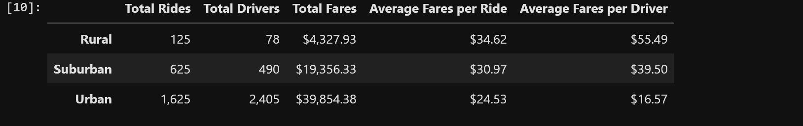

# PyBer_Analysis

## Overview of Analysis

The purpose of this analysis is to analyze PyBer ride data broken down by city type to account for disparities in different types of riderr and to make recommendations to reduce disparities.

## Analysis

As shown in the summary table, rural areas have the least drivers, most expensive rides, most fare per driver, and lowest total fares. Urban areas have the most drivers, cheapest rides, least fare per driver, and highest total fares. Suburban values are in the middle on all of these indicators. The Fare Summary graph shows that, between January 1, 2019 and April 29, 2019, urban areas collected the most weekly fares, followed by suburban areas and rural areas. Fare collection is relatively stable for all areas except possibly suburban areas at the end of April, possibly indicating the beginning of warmer weather causing more trips.

## Summary

I recommend the following measures to address inequities between city types:

- Increase fares in urban cities, but not so much that the increase will lower total collections.
- Use increased fare revenue to lower fares in rural cities.
- Use increased fare revenue to increase compensation for urban drivers, but do not lower compensation for suburban or rural drivers.
